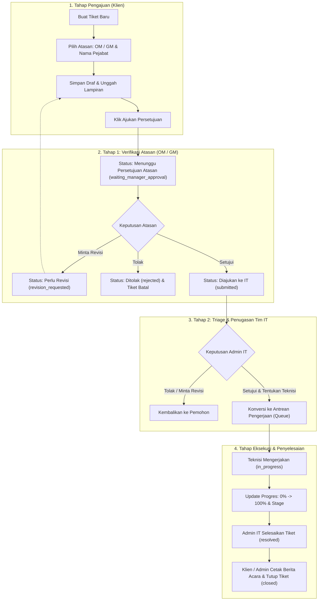

# 📘 BUKU PANDUAN LENGKAP PENGGUNA (USER MANUAL & SOP)
# SISTEM INFORMASI TICKETING & MANAJEMEN PROYEK IT

---

## 📑 DAFTAR ISI
1. [BAB I: PENDAHULUAN & ARSITEKTUR SISTEM](#bab-i-pendahuluan--arsitektur-sistem)
   - 1.1 Latar Belakang & Tujuan
   - 1.2 Glosarium & Definisi Istilah
   - 1.3 Matriks Hak Akses & Peran Pengguna (Role Matrix)
2. [BAB II: MANAJEMEN AKUN & AUTENTIKASI](#bab-ii-manajemen-akun--autentikasi)
   - 2.1 Registrasi & Aktivasi Akun
   - 2.2 Proses Masuk (Login) & Lupa Kata Sandi
   - 2.3 Pengelolaan Profil Pengguna
3. [BAB III: SIKLUS HIDUP TIKET & LOGIKA SLA (SERVICE LEVEL AGREEMENT)](#bab-iii-siklus-hidup-tiket--logika-sla)
   - 3.1 Diagram Alur Persetujuan 2 Tingkat (2-Tier Approval Workflow)
   - 3.2 Penjelasan Status Tiket (Status Lifecycle)
   - 3.3 Matriks Penentuan Tingkat Prioritas
   - 3.4 Mekanisme Penghitungan & Jeda Waktu SLA (Pause/Play SLA)
4. [BAB IV: PANDUAN PENGGUNAAN UNTUK PEMOHON / KLIEN (CLIENT)](#bab-iv-panduan-penggunaan-untuk-pemohon--klien-client)
   - 4.1 Membuat Pengajuan Tiket Baru
   - 4.2 Panduan Pemilihan Atasan Penyetuju (OM / GM)
   - 4.3 Mengunggah & Melihat Pratinjau Berkas Kebutuhan
   - 4.4 Mengajukan Tiket untuk Persetujuan
   - 4.5 Memantau Status & Live Progress Pengerjaan
   - 4.6 Menangani Permintaan Revisi dari Atasan / IT
   - 4.7 Mengunduh & Mencetak Berita Acara (BA) Pengerjaan IT
   - 4.8 Membatalkan atau Menutup Tiket
5. [BAB V: PANDUAN PENGGUNAAN UNTUK ATASAN MANAJER (OM & GM)](#bab-v-panduan-penggunaan-untuk-atasan-manajer-om--gm)
   - 5.1 Navigasi Dasbor Eksekutif Monitoring
   - 5.2 Membaca Metrik KPI & Status Kepatuhan SLA
   - 5.3 Meninjau Pengajuan Tiket Bawahan (Menu Persetujuan Saya)
   - 5.4 Memberikan Keputusan: Setujui, Minta Revisi, atau Tolak
   - 5.5 Memantau Papan Live Tracking Proyek Berjalan
6. [BAB VI: PANDUAN PENGGUNAAN UNTUK ADMIN IT / TRIAGE](#bab-vi-panduan-penggunaan-untuk-admin-it--triage)
   - 6.1 Melakukan Triage & Evaluasi Teknis
   - 6.2 Penugasan Teknisi (Developer PIC) & Penjadwalan
   - 6.3 Mengelola Papan Antrian (Queue Management)
   - 6.4 Mengalihkan Penugasan Teknisi (Re-assign Developer)
   - 6.5 Mengoperasikan Jeda Waktu (Pause / Play SLA Clock)
   - 6.6 Menyelesaikan Tiket (Resolve Ticket)
7. [BAB VII: PANDUAN PENGGUNAAN UNTUK TEKNISI / DEVELOPER](#bab-vii-panduan-penggunaan-untuk-teknisi--developer)
   - 7.1 Menerima & Memeriksa Antrean Tugas
   - 7.2 Memperbarui Tahapan Kerja (Stages) & Persentase Progres (0–100%)
   - 7.3 Mencatat Log Aktivitas Pengerjaan & Lampiran Bukti
   - 7.4 Mengisi Log Harian Teknisi (Daily Log)
8. [BAB VIII: PANDUAN PENGGUNAAN UNTUK SUPER ADMIN](#bab-viii-panduan-penggunaan-untuk-super-admin)
   - 8.1 Dasbor Analitik & Statistik Global
   - 8.2 Manajemen Pengguna (Tambah, Edit, Suspend, Ganti Role)
   - 8.3 Rekapitulasi Laporan Bulanan & Laporan Teknis (Export CSV & PDF)
   - 8.4 Audit Trail Log Aktivitas Sistem (Activity Logs)
   - 8.5 Konfigurasi Pengaturan Sistem (Settings)
9. [BAB IX: PANDUAN NOTIFIKASI EMAIL & FITUR CHAT SUPPORT](#bab-ix-panduan-notifikasi-email--fitur-chat-support)
   - 9.1 Matriks Trigger Notifikasi Email Otomatis
   - 9.2 Menggunakan Obrolan Langsung (Chat Support)
10. [BAB X: TANYA JAWAB, TROUBLESHOOTING & FAQ](#bab-x-tanya-jawab-troubleshooting--faq)

---

# BAB I: PENDAHULUAN & ARSITEKTUR SISTEM

## 1.1 Latar Belakang & Tujuan
Sistem Informasi Ticketing & Manajemen Proyek IT dibangun untuk mendigitalkan dan menstandarisasi tata kelola permintaan layanan teknologi informasi, perbaikan perangkat, pengembangan sistem baru, serta dukungan teknis operasional.

**Tujuan Implementasi Sistem:**
1. **Transparansi**: Setiap pemohon dapat melihat secara persis siapa atasan yang memvalidasi, teknisi yang menangani, tahapan pengerjaan, hingga persentase progres secara *real-time*.
2. **Akuntabilitas Bertingkat (2-Tier Governance)**: Memastikan pengajuan tiket telah disetujui secara manajerial oleh atasan (*Operational Manager* atau *General Manager*) sebelum masuk ke antrean kerja Tim IT.
3. **Kepatuhan Waktu (SLA Management)**: Mengukur kecepatan respon (*First Response SLA*) dan ketepatan waktu penyelesaian (*Resolution SLA*) secara presisi.
4. **Dokumentasi & Legalitas Resmi**: Otomatisasi penerbitan dokumen Berita Acara (BA) Pengerjaan IT lengkap dengan rincian teknis, log kronologis, dan tanda tangan digital.

---

## 1.2 Glosarium & Definisi Istilah
- **Tiket (Project Request)**: Berkas digital yang memuat permohonan layanan, pelaporan kendala, atau proyek baru yang diajukan oleh pengguna.
- **Queue (Papan Antrean)**: Daftar pekerjaan aktif yang sedang dijadwalkan atau dikerjakan oleh teknisi.
- **2-Tier Approval**: Alur persetujuan dua tahap; Tahap 1 oleh Atasan Manajer (OM/GM), Tahap 2 oleh Admin IT (Triage & Penugasan).
- **SLA (Service Level Agreement)**: Standar komitmen waktu penyelesaian layanan IT.
- **SLA Response**: Batas waktu sejak tiket diajukan hingga tiket pertama kali ditanggapi/disetujui.
- **SLA Resolution**: Batas waktu maksimal hingga tiket dinyatakan tuntas dan diselesaikan.
- **Pause SLA**: Fitur untuk membekukan perhitungan waktu SLA sementara ketika pengerjaan terhenti oleh faktor eksternal di luar kendali Tim IT (misal: menunggu suku cadang/vendor).
- **Berita Acara (BA)**: Dokumen pertanggungjawaban pengerjaan teknis yang dicetak atau diunduh dalam format PDF resmi.
- **Daily Log**: Catatan aktivitas pengerjaan harian yang diisi oleh teknisi/developer.

---

## 1.3 Matriks Hak Akses & Peran Pengguna (Role Matrix)

| Fitur / Modul | Client | Operational Manager | General Manager | Developer | Admin IT | Super Admin |
| :--- | :---: | :---: | :---: | :---: | :---: | :---: |
| **Buat & Edit Tiket Draf** | ✅ | ✅ | ✅ | ❌ | ✅ | ✅ |
| **Pilih Atasan Penyetuju (OM/GM)** | ✅ | ✅ | ✅ | ❌ | ✅ | ✅ |
| **Persetujuan Tingkat 1 (Approval OM/GM)** | ❌ | ✅ | ✅ | ❌ | ❌ | ✅ (Override) |
| **Dasbor Monitoring Manajerial** | ❌ | ✅ | ✅ | ❌ | ❌ | ❌ |
| **Triage & Penugasan Teknisi (Tier 2)** | ❌ | ❌ | ❌ | ❌ | ✅ | ✅ |
| **Papan Antrean (Queue List)** | ❌ | ❌ | ❌ | ✅ (Milik Sendiri) | ✅ (Semua) | ✅ (Semua) |
| **Update Progres & Tahapan Kerja** | ❌ | ❌ | ❌ | ✅ | ✅ | ✅ |
| **Pause / Play Perhitungan SLA** | ❌ | ❌ | ❌ | ❌ | ✅ | ✅ |
| **Selesaikan Tiket (Resolve)** | ❌ | ❌ | ❌ | ❌ | ✅ | ✅ |
| **Tutup Tiket (Close)** | ✅ (Milik Sendiri) | ❌ | ❌ | ❌ | ✅ | ✅ |
| **Unduh / Cetak Berita Acara (PDF)** | ✅ | ✅ | ✅ | ✅ | ✅ | ✅ |
| **Isi Log Harian (Daily Log)** | ❌ | ❌ | ❌ | ✅ | ✅ | ✅ |
| **Manajemen Pengguna (Users)** | ❌ | ❌ | ❌ | ❌ | ✅ | ✅ |
| **Rekap Laporan CSV & PDF** | ❌ | ❌ | ❌ | ❌ | ✅ | ✅ |
| **Konfigurasi Pengaturan Sistem** | ❌ | ❌ | ❌ | ❌ | ❌ | ✅ |

---

# BAB II: MANAJEMEN AKUN & AUTENTIKASI

## 2.1 Registrasi & Aktivasi Akun
1. Buka halaman utama aplikasi di peramban web (*browser*).
2. Klik tombol **"Daftar Akun Baru"** pada halaman login.
3. Masukkan data diri secara lengkap:
   - **Nama Lengkap**: Nama asli pengguna.
   - **Alamat Email**: Gunakan email instansi yang aktif (contoh: `nama@perusahaan.com`).
   - **Nomor Telepon / WhatsApp**: Nomor aktif untuk keperluan konfirmasi darurat.
   - **Nama Perusahaan / Divisi**: Unit kerja Anda.
   - **Kata Sandi**: Minimal 8 karakter kombinasi huruf dan angka.
4. Klik tombol **"Daftar"**. Akun baru secara default terdaftar sebagai peran **Client**.

---

## 2.2 Proses Masuk (Login) & Lupa Kata Sandi
1. Akses halaman Login.
2. Masukkan alamat email dan kata sandi yang telah terdaftar.
3. Klik tombol **"Masuk"**. Sistem akan mengarahkan Anda ke dasbor yang sesuai dengan peran Anda.
4. **Jika Lupa Kata Sandi**:
   - Klik tautan **"Lupa Kata Sandi?"**.
   - Masukkan alamat email Anda.
   - Sistem akan mengirimkan tautan pemulihan kata sandi ke kotak masuk email Anda.

---

## 2.3 Pengelolaan Profil Pengguna
1. Klik nama akun Anda di pojok kanan atas layar atau klik menu **"Profil"**.
2. Anda dapat memperbarui:
   - Nama tampilan.
   - Nomor telepon dan instansi.
   - Mengganti kata sandi lama dengan kata sandi baru.
3. Klik **"Simpan Perubahan"**.

---

# BAB III: SIKLUS HIDUP TIKET & LOGIKA SLA

## 3.1 Diagram Alur Persetujuan 2 Tingkat (2-Tier Approval Workflow)



---

## 3.2 Penjelasan Status Tiket (Status Lifecycle)

1. **`draft` (Draf)**: Tiket baru dibuat oleh pemohon dan belum diajukan secara resmi. Pemohon masih bebas mengedit data dan berkas.
2. **`waiting_manager_approval` (Menunggu Persetujuan Atasan)**: Tiket telah dikirim oleh pemohon dan sedang berada di antrean persetujuan Atasan Manajer (OM atau GM).
3. **`revision_requested` (Perlu Revisi)**: Atasan atau Tim IT meminta pemohon memperbaiki atau melengkapi data/lampiran tiket.
4. **`submitted` (Diajukan / Diteruskan ke IT)**: Tiket telah disetujui oleh Atasan Manajer dan sedang berada di meja kerja Admin IT untuk ditriage dan ditugaskan ke teknisi.
5. **`converted_to_queue` / `in_progress` (Dalam Pengerjaan)**: Tiket telah disetujui Tim IT, masuk ke papan antrean pengerjaan teknisi, dan pengerjaan fisik/sistem sedang berlangsung.
6. **`paused` (Dijeda)**: Perhitungan SLA tiket dihentikan sementara oleh Admin IT karena kendala pihak ketiga.
7. **`resolved` (Selesai)**: Pengerjaan teknis telah diselesaikan 100% oleh teknisi dan divalidasi oleh Admin IT.
8. **`closed` (Ditutup)**: Tiket telah dikonfirmasi selesai oleh pemohon, Berita Acara dapat diunduh, dan tiket diarsipkan secara permanen.
9. **`rejected` / `cancelled` (Ditolak / Dibatalkan)**: Tiket ditolak oleh atasan/IT atau dibatalkan oleh pemohon.

---

## 3.3 Matriks Penentuan Tingkat Prioritas
Sistem secara otomatis menghitung tingkat prioritas tiket berdasarkan kombinasi **Dampak (*Impact*)** dan **Urgensi (*Urgency*)**:

$$\text{Skor Prioritas} = \text{Bobot Dampak} + \text{Bobot Urgensi}$$

| Bobot Nilai | Tingkat Dampak | Tingkat Urgensi |
| :---: | :--- | :--- |
| **1** | Rendah (*Low*) | Rendah (*Low*) |
| **2** | Sedang (*Medium*) | Sedang (*Medium*) |
| **3** | Tinggi (*High*) | Tinggi (*High*) |
| **4** | Kritis (*Critical*) | Kritis (*Critical*) |

**Hasil Pemetaan Prioritas:**
- **Skor 7 – 8**: 🔴 **Prioritas Tinggi (*High*)** $\to$ Ditangani paling awal dengan SLA dipercepat.
- **Skor 4 – 6**: 🟡 **Prioritas Sedang (*Medium*)** $\to$ Ditangani sesuai antrean standar.
- **Skor 2 – 3**: 🟢 **Prioritas Rendah (*Low*)** $\to$ Ditangani terjadwal.

---

## 3.4 Mekanisme Penghitungan & Jeda Waktu SLA (Pause/Play SLA)
- **Target SLA Respon**: Waktu maksimal sejak tiket berstatus `submitted` sampai Admin IT menetapkan teknisi penanggung jawab (default: 2–4 jam kerja).
- **Target SLA Penyelesaian**: Waktu maksimal sejak tiket berstatus `in_progress` sampai berstatus `resolved` (default: 24–72 jam kerja sesuai kompleksitas).
- **Fitur Pause SLA**:
  - Jika ada komponen perangkat keras (*hardware*) yang harus dibeli atau menunggu kedatangan teknisi vendor luar, Admin IT dapat menekan tombol **"Pause Tiket"**.
  - Jam hitung mundur SLA otomatis berhenti.
  - Saat barang datang atau vendor tiba, Admin IT menekan tombol **"Play Tiket"** sehingga sisa waktu SLA dilanjutkan secara adil dan akurat tanpa merusak metrik performa tim IT.

---

# BAB IV: PANDUAN PENGGUNAAN UNTUK PEMOHON / KLIEN (CLIENT)

## 4.1 Membuat Pengajuan Tiket Baru
1. Masuk ke akun Anda.
2. Klik tombol **"+ Buat Tiket"** di menu atas atau sidebar.
3. Masukkan informasi formulir:
   - **Nama Proyek / Kendala**: Beri judul yang spesifik (contoh: *Permintaan Akun Email & Akses VPN Karyawan Baru*).
   - **Kategori Tiket**:
     - *Insiden*: Kerusakan sistem mendadak atau gangguan operasional.
     - *Permintaan Layanan*: Permintaan rutin (instalasi software, setup PC baru).
     - *Akses*: Pembuatan akun, hak akses folder, reset akses server.
     - *Bug*: Kesalahan logika pada aplikasi/sistem internal.
     - *Dukungan Teknis*: Kendala perangkat keras, wifi, printer.
     - *Lainnya*: Permintaan di luar kategori di atas.
   - **Subkategori Teknis** *(Otomatis muncul jika memilih Dukungan Teknis)*: Pilih *Wifi, Printer, Komputer, Software Install,* atau *Supporting*.
   - **Dampak & Urgensi**: Tentukan tingkat pengaruh kendala terhadap operasional kerja Anda.
   - **Estimasi Durasi**: Harapan estimasi waktu pengerjaan (dalam satuan hari).
   - **Deskripsi Lengkap**: Tuliskan kronologi masalah, pesan kesalahan (*error message*), dan lokasi perangkat.

---

## 4.2 Panduan Pemilihan Atasan Penyetuju (OM / GM)
Pada bagian kartu **Persetujuan Atasan (Manager Approval)**:
1. **Jabatan Atasan Penyetuju**:
   - Pilih **Operational Manager (OM)** untuk kebutuhan operasional harian, perbaikan rutin divisi, dan permohonan teknis standar.
   - Pilih **General Manager (GM)** untuk kebutuhan proyek strategis, pengadaan perangkat bernilai tinggi, atau perubahan arsitektur sistem lintas departemen.
2. **Nama Pejabat / Manager**:
   - Sistem akan secara dinamis menyaring dan menampilkan daftar nama pejabat yang aktif memegang jabatan tersebut.
   - Pilih nama manajer Anda.

---

## 4.3 Mengunggah & Melihat Pratinjau Berkas Kebutuhan
1. Klik kotak **"Unggah Berkas"**.
2. Anda dapat memilih lebih dari satu file (multi-upload) berupa dokumen PDF, Word (.docx), atau foto tangkapan layar (.jpg, .png) dengan batas maksimal 10MB per berkas.
3. Setelah disimpan, berkas lampiran dapat langsung dilihat pratinjaunya (*preview*) di dalam aplikasi tanpa perlu mengunduh terlebih dahulu menggunakan fitur **PDF Viewer Modal**.

---

## 4.4 Mengajukan Tiket untuk Persetujuan
1. Setelah formulir disimpan, tiket Anda berada dalam status `Draf`.
2. Periksa kembali kelengkapan rincian pada halaman tiket.
3. Klik tombol hijau **"Ajukan Persetujuan"**.
4. Status tiket berubah menjadi `Menunggu Persetujuan Atasan` (`waiting_manager_approval`).
5. Atasan Anda akan secara otomatis menerima notifikasi email yang berisi tautan langsung untuk meninjau tiket Anda.

---

## 4.5 Memantau Status & Live Progress Pengerjaan
1. Buka menu **"Permintaan Saya"** (`/project-requests`).
2. Klik tombol **"Lihat Detail"** pada tiket.
3. Di halaman ini Anda dapat memantau:
   - **Badge Status Tiket**: Menunjukkan posisi tiket saat ini.
   - **Informasi Penyetuju**: Menampilkan nama atasan yang telah menyetujui beserta waktu persetujuan.
   - **Teknisi Penanggung Jawab**: Nama teknisi IT yang ditugaskan mengerjakan tiket Anda.
   - **Bilah Progres Real-Time**: Persentase pengerjaan (0% s/d 100%) dan tahapan yang sedang berlangsung.
   - **Tenggat Waktu SLA**: Waktu penyelesaian yang dijanjikan sistem.

---

## 4.6 Menangani Permintaan Revisi dari Atasan / IT
1. Jika tiket Anda membutuhkan revisi, Anda akan menerima email pemberitahuan berjudul `Revisi Diperlukan: [Nomor Tiket]`.
2. Buka halaman tiket, Anda akan melihat catatan perbaikan dari atasan/IT pada kotak peringatan kuning.
3. Klik tombol **"Ubah"** di bagian atas rincian tiket.
4. Sesuaikan deskripsi atau unggah berkas pengganti yang diminta.
5. Klik tombol **"Kirim Revisi"**. Tiket akan kembali masuk ke antrean persetujuan.

---

## 4.7 Mengunduh & Mencetak Berita Acara (BA) Pengerjaan IT
Setelah pengerjaan tiket dinyatakan selesai (`Resolved` atau `Closed`):
1. Buka halaman rincian tiket.
2. Di panel sebelah kanan bawah, temukan bagian **Berita Acara Pengerjaan IT**.
3. Pilihan Cetak:
   - Klik **"Unduh Berita Acara (PDF)"** untuk mengunduh dokumen arsip berformat PDF resmi.
   - Klik **"Pratinjau & Cetak BA"** untuk membuka jendela cetak langsung di peramban.

---

# BAB V: PANDUAN PENGGUNAAN UNTUK ATASAN MANAJER (OM & GM)

## 5.1 Navigasi Dasbor Eksekutif Monitoring
Saat **Operational Manager** atau **General Manager** masuk ke sistem, Anda akan disambut oleh **Dasbor Monitoring Manajerial** (`/dashboard`):
- **Banner Eksekutif**: Menampilkan sapaan resmi, role jabatan Anda, serta tombol akses cepat ke *Persetujuan Saya* dan *Semua Tiket*.
- **Kotak Peringatan Mendesak (*Pending Alert*)**: Otomatis muncul di bagian atas jika ada pengajuan bawahan yang belum Anda putuskan.

---

## 5.2 Membaca Metrik KPI & Status Kepatuhan SLA
Terdapat 4 kartu indikator utama pada dasbor manajer:
1. ⏳ **Menunggu Approval Saya**: Jumlah tiket yang sedang menunggu tanda tangan digital / persetujuan Anda.
2. ⚙️ **Tiket Dalam Pengerjaan IT**: Jumlah proyek/kendala yang sedang aktif dikerjakan oleh teknisi.
3. ✅ **Tiket Selesai Bulan Ini**: Total keberhasilan penyelesaian tugas pada bulan berjalan.
4. ⏱️ **SLA Status**: Menandai apakah pekerjaan tim IT berjalan tepat waktu (*On Track*) atau terdapat kendala yang lewat batas waktu (*Overdue*).

---

## 5.3 Meninjau Pengajuan Tiket Bawahan (Menu Persetujuan Saya)
1. Klik menu **"Persetujuan Saya"** di menu atas atau sidebar.
2. Anda akan melihat daftar tabel tiket yang secara spesifik menunjuk Anda sebagai Atasan Penyetuju.
3. Klik tombol biru **"Tinjau"** pada baris tiket yang ingin diperiksa.
4. Halaman persetujuan akan menampilkan:
   - Nama Pemohon dan Departemen.
   - Kategori kendala, estimasi waktu, serta tingkat urgensi.
   - Deskripsi lengkap kebutuhan.
   - Berkas lampiran pendukung (klik tombol **"Lihat"** untuk membuka pratinjau dokumen langsung di layar).

---

## 5.4 Memberikan Keputusan: Setujui, Minta Revisi, atau Tolak
Pada panel formulir sebelah kanan halaman persetujuan:

```
+-------------------------------------------------------------+
| OPSI KEPUTUSAN ATASAN:                                      |
|                                                             |
| 1. [SETUJUI]      --> Tiket Diteruskan ke Tim IT             |
| 2. [MINTA REVISI] --> Tiket Dikembalikan ke Pemohon          |
| 3. [TOLAK]        --> Tiket Dibatalkan Permanen             |
+-------------------------------------------------------------+
```

1. **Menyetujui Pengajuan (Approve)**:
   - Tuliskan catatan persetujuan opsional pada kotak komentar.
   - Klik tombol hijau **"Setujui & Teruskan ke IT"**.
   - Tiket akan otomatis berpindah status ke `Diajukan ke IT` (`submitted`) dan Admin IT akan menerima email notifikasi untuk melakukan triage teknisi.
2. **Meminta Revisi (Request Revision)**:
   - Tuliskan rincian kekurangan yang harus dilengkapi oleh pemohon pada kolom *Catatan Revisi*.
   - Klik tombol kuning **"Kirim Permintaan Revisi"**.
   - Pemohon akan menerima notifikasi email dan tiket berstatus `Perlu Revisi`.
3. **Menolak Pengajuan (Reject)**:
   - Tuliskan alasan objektif penolakan pada kolom *Alasan Penolakan*.
   - Klik tombol merah **"Tolak Proyek"**.
   - Tiket akan ditutup dengan status `Ditolak` dan pemohon akan menerima email pemberitahuan.

---

## 5.5 Memantau Papan Live Tracking Proyek Berjalan
Pada bagian bawah dasbor manajer terdapat tabel **Live Tracking Tiket Berjalan**:
- Anda dapat melihat perkembangan seluruh tiket operasional secara transparan.
- Kolom **Teknisi PIC** menampilkan nama petugas IT yang bertanggung jawab.
- Kolom **Progres** menampilkan bilah persentase aktual (misal: 75%).

---

# BAB VI: PANDUAN PENGGUNAAN UNTUK ADMIN IT / TRIAGE

## 6.1 Melakukan Triage & Evaluasi Teknis
1. Buka menu **"Persetujuan"** (`/approvals`).
2. Tiket yang muncul di antrean Admin IT adalah tiket yang **telah resmi disetujui oleh Atasan Manajer (OM/GM)**.
3. Klik tombol **"Tinjau"** pada tiket.
4. Lakukan evaluasi teknis terhadap spesifikasi permohonan dan ketersediaan sumber daya tim IT.

---

## 6.2 Penugasan Teknisi (Developer PIC) & Penjadwalan
1. Pada panel samping kanan kartu persetujuan:
2. Pada dropdown **"Penugasan Developer / Teknisi"**, pilih nama teknisi yang memiliki beban kerja (*active workload*) paling seimbang. Sistem akan menampilkan jumlah tiket aktif yang sedang dipegang oleh masing-masing teknisi.
3. Masukkan catatan instruksi teknis jika ada.
4. Klik tombol hijau **"Setujui & Buat Antrian"**.
5. Sistem secara otomatis akan:
   - Mengubah status tiket menjadi `converted_to_queue` dan `in_progress`.
   - Membuat kartu kerja baru di **Papan Antrean (*Queue*)**.
   - Mengirim notifikasi email penugasan ke teknisi terkait.
   - Mengirim notifikasi email kepada pemohon bahwa tiket mulai dikerjakan.

---

## 6.3 Mengelola Papan Antrian (Queue Management)
1. Buka menu **"Papan Antrian"** (`/queues`).
2. Seluruh tiket yang sedang dikerjakan tim IT akan tercantum dalam antrean.
3. Gunakan filter pencarian untuk menyaring antrean berdasarkan nama proyek, status antrean (*Pending, In Progress, Resolved*), atau nama teknisi.

---

## 6.4 Mengalihkan Penugasan Teknisi (Re-assign Developer)
Jika seorang teknisi berhalangan hadir, sakit, atau mengalami kendala kapasitas:
1. Buka menu **"Papan Antrian"**.
2. Temukan tiket yang bersangkutan, lalu pilih nama teknisi pengganti pada kolom penugasan.
3. Klik tombol simpan penugasan. Teknisi baru akan menerima notifikasi pengalihan tugas.

---

## 6.5 Mengoperasikan Jeda Waktu (Pause / Play SLA Clock)
1. Buka detail tiket yang sedang berjalan.
2. Jika terjadi kendala eksternal:
   - Klik tombol kuning **"Pause Tiket"**.
   - Konfirmasi pada kotak dialog SweetAlert.
   - Status tiket berubah menjadi `paused` dan waktu SLA berhenti.
3. Saat pengerjaan siap dilanjutkan:
   - Klik tombol hijau **"Play Tiket"**.
   - Status kembali menjadi `in_progress` dan jam SLA berlanjut.

---

## 6.6 Menyelesaikan Tiket (Resolve Ticket)
1. Setelah teknisi menyelesaikan pengerjaan hingga 100% dan melakukan pengujian:
2. Admin IT membuka halaman detail tiket.
3. Klik tombol hijau **"Selesaikan Tiket"**.
4. Status tiket berubah menjadi `resolved`, jam penyelesaian dicatat, dan pemohon akan dikirimi email konfirmasi penyelesaian.

---

# BAB VII: PANDUAN PENGGUNAAN UNTUK TEKNISI / DEVELOPER

## 7.1 Menerima & Memeriksa Antrean Tugas
1. Masuk ke aplikasi menggunakan akun Developer/Teknisi Anda.
2. Pada menu **"Papan Antrian"** atau **"Tiket Saya"**, Anda hanya akan melihat tiket yang ditugaskan kepada Anda.
3. Periksa rincian deskripsi pekerjaan, lampiran kebutuhan dari pemohon, dan batas tenggat waktu (*deadline*).

---

## 7.2 Memperbarui Tahapan Kerja (Stages) & Persentase Progres (0–100%)
1. Klik tombol **"Lihat Progres"** pada kartu tiket yang sedang Anda kerjakan.
2. Anda akan diarahkan ke halaman pelacakan progres (`/progress/{id}`).
3. **Memperbarui Persentase**:
   - Geser atau ketikkan angka progres kerja (contoh: dari 25% ke 60%).
   - Klik tombol **"Perbarui Progres"**.
4. **Memperbarui Tahapan Kerja (*Stage*)**:
   - Pilih tahapan yang sedang aktif:
     - 🔍 *Analisis Kebutuhan*: Mempelajari sistem dan merumuskan solusi.
     - 🎨 *Perancangan / Desain*: Menyiapkan topologi jaringan, desain antarmuka, atau skema basis data.
     - 💻 *Koding / Eksekusi Fisik*: Menulis program, merakit perangkat, atau instalasi kabel jaringan.
     - 🧪 *Pengujian / Validasi*: Melakukan uji fungsi dan uji coba bersama pemohon.
     - 🚀 *Deployment / Serah Terima*: Pemasangan resmi di lingkungan produksi.
   - Klik **"Simpan Tahapan"**.

---

## 7.3 Mencatat Log Aktivitas Pengerjaan & Lampiran Bukti
1. Pada halaman progres kerja tiket, temukan kolom **"Catat Aktivitas Baru"**.
2. Masukkan rincian pekerjaan yang baru saja Anda lakukan (contoh: *Selesai melakukan konfigurasi router Mikrotik dan pengujian bandwidth wifi di lantai 2*).
3. Unggah foto bukti pengerjaan atau dokumen hasil pengujian jika ada.
4. Klik **"Kirim Log Aktivitas"**. Aktivitas ini akan tercatat permanen pada linimasa tiket dan dapat dilihat oleh pemohon serta atasan.

---

## 7.4 Mengisi Log Harian Teknisi (Daily Log)
1. Buka menu **"Log Harian"** (`/daily-logs`) di sidebar.
2. Klik tombol **"+ Tambah Log Harian"**.
3. Masukkan tanggal kerja, daftar tugas yang diselesaikan hari ini, estimasi jam kerja, dan kendala teknis yang dihadapi.
4. Klik **"Simpan Log Harian"**. Log harian ini berfungsi sebagai rekap kinerja Anda yang dapat dievaluasi oleh Super Admin dan pimpinan IT.

---

# BAB VIII: PANDUAN PENGGUNAAN UNTUK SUPER ADMIN

## 8.1 Dasbor Analitik & Statistik Global
Sebagai **Super Admin**, dasbor utama (`/super-admin/dashboard`) menyajikan pusat komando analitik:
- **Statistik Volume Tiket**: Total tiket masuk, tiket selesai, tiket tertunda, dan tiket batal.
- **Rasio Beban Kerja Teknisi**: Grafik distribusi tiket per teknisi.
- **Analisis Kategori Gangguan**: Grafik pai (*pie chart*) kategori kendala paling sering terjadi (Hardware, Software, Jaringan, Akses).
- **Kepatuhan SLA Instansi**: Persentase kepatuhan penyelesaian tepat waktu terhadap target SLA.

---

## 8.2 Manajemen Pengguna (Tambah, Edit, Suspend, Ganti Role)
1. Buka menu **"Pengguna & Aset"** (`/super-admin/users`).
2. **Menambah Pengguna Baru**:
   - Klik tombol **"+ Tambah Pengguna"**.
   - Isi Nama, Email, Nomor Telepon, Instansi, Kata Sandi.
   - Pilih peran pengguna: *Client, Developer, Operational Manager, General Manager, Admin,* atau *Super Admin*.
   - Klik **"Simpan"**.
3. **Mengubah Peran atau Data Pengguna**:
   - Klik tombol edit (ikon pensil) pada baris pengguna.
   - Ubah data atau tingkatkan hak akses pengguna, lalu simpan.
4. **Menonaktifkan Akun (Suspend / Deactivate)**:
   - Jika pegawai telah mutasi atau purna tugas, klik tombol **"Nonaktifkan"**.
   - Akun tidak akan dapat masuk ke sistem, namun seluruh riwayat tiket dan log masa lalu tetap aman tersimpan.

---

## 8.3 Rekapitulasi Laporan Bulanan & Laporan Teknis (Export CSV & PDF)
1. Buka menu **"Laporan"** (`/super-admin/reports`).
2. Tentukan kriteria filter laporan:
   - Rentang Tanggal (*Bulan Ini, Kuartal Ini, Tahun Ini, atau Kustom*).
   - Kategori Tiket.
   - Status Penyelesaian.
3. Pilihan Ekspor:
   - Klik **"Export CSV"** untuk mengunduh berkas spreadsheet yang kompatibel dengan Microsoft Excel untuk pengolahan data lanjutan.
   - Klik **"Export PDF"** untuk mengunduh laporan eksekutif lengkap dengan kop resmi dan tabel ringkasan kinerja tim.

---

## 8.4 Audit Trail Log Aktivitas Sistem (Activity Logs)
1. Buka menu **"Activity Logs"** (`/super-admin/activity-logs`).
2. Sistem secara otomatis merekam setiap tindakan penting:
   - Siapa yang membuat tiket, jam berapa tiket disetujui atasan, catatan revisi apa yang dikirim, siapa yang mengubah penugasan teknisi, hingga kapan Berita Acara diunduh.
3. Fitur ini menjamin kepatuhan audit keamanan informasi dan mencegah penyangkalan (*non-repudiation*).

---

## 8.5 Konfigurasi Pengaturan Sistem (Settings)
1. Buka menu **"Pengaturan"** (`/super-admin/settings`).
2. Pengaturan yang dapat dikonfigurasi:
   - **Nama Aplikasi & Instansi**: Mengubah nama sistem yang tampil di header dan kop surat.
   - **Logo & Favicon**: Mengunggah logo instansi untuk kop Berita Acara dan ikon tab browser.
   - **Target Durasi Default SLA**: Mengatur batas waktu standar penanganan tiket.
   - **Notifikasi Email**: Mengaktifkan atau menonaktifkan sakelar pengiriman email otomatis.
3. Klik **"Simpan Pengaturan"**.

---

# BAB IX: PANDUAN NOTIFIKASI EMAIL & FITUR CHAT SUPPORT

## 9.1 Matriks Trigger Notifikasi Email Otomatis

| Peristiwa / Trigger | Penerima Email | Subjek Email | Aksi Langsung |
| :--- | :--- | :--- | :--- |
| **Klien Mengajukan Tiket** | Atasan (OM / GM) | `Tiket Baru Menunggu Approval Atasan: [Kode]` | Tombol "Tinjau Tiket" |
| **Klien Mengajukan Tiket** | Klien (Pemohon) | `Tiket Terkirim ke Atasan: [Kode]` | Tombol "Lihat Detail Tiket" |
| **Atasan Menyetujui Tiket** | Admin IT | `Tiket Disetujui Atasan (Siap Triage IT): [Kode]` | Tombol "Triage Tiket IT" |
| **Atasan Menyetujui Tiket** | Klien (Pemohon) | `Tiket Disetujui Atasan: [Kode]` | Tombol "Lihat Detail Tiket" |
| **Atasan Meminta Revisi** | Klien (Pemohon) | `Revisi Diperlukan: [Kode]` | Tombol "Perbarui Tiket" |
| **Atasan Menolak Tiket** | Klien (Pemohon) | `Tiket Ditolak: [Kode]` | Tombol "Lihat Detail Tiket" |
| **Admin IT Menugaskan Dev** | Teknisi (Dev) | `Penugasan Tiket Baru: [Kode]` | Tombol "Buka Antrean" |
| **Admin IT Menyetujui Tiket** | Klien (Pemohon) | `Tiket Disetujui IT: [Kode]` | Tombol "Lihat Detail Tiket" |

---

## 9.2 Menggunakan Obrolan Langsung (Chat Support)
*Fitur Chat tersedia untuk Klien, Teknisi, dan Admin:*
1. Klik menu **"Chat"** pada menu atas atau buka ikon obrolan mengambang (*floating widget*) di sudut kanan bawah.
2. Anda dapat mengirim pesan teks, bertanya perkembangan tiket, atau mengirim dokumen gambar secara langsung kepada teknisi yang bertugas.
3. Seluruh riwayat obrolan tersimpan rapi dan terhubung dengan nomor tiket yang bersangkutan.

---

# BAB X: TANYA JAWAB, TROUBLESHOOTING & FAQ

### Q1: Mengapa saya mendapatkan pesan "Error 403: Akses Ditolak"?
> **Jawaban:** Pesan 403 muncul jika Anda mencoba mengakses halaman yang tidak diperuntukkan bagi hak akses (role) Anda. Pastikan Anda masuk dengan akun yang memiliki hak otorisasi yang sesuai.

### Q2: Mengapa tombol "Ajukan Persetujuan" tidak muncul setelah tiket dibuat?
> **Jawaban:** Tombol "Ajukan Persetujuan" hanya muncul jika Anda login sebagai **Klien (Pemohon)** dan tiket masih berstatus `Draf` atau `Perlu Revisi`. Jika tiket sudah berstatus `Menunggu Persetujuan Atasan`, tiket sedang diproses oleh atasan Anda.

### Q3: Berkas apa saja yang didukung untuk lampiran kebutuhan?
> **Jawaban:** Sistem mendukung berkas berekstensi `.pdf`, `.doc`, `.docx`, `.jpg`, `.jpeg`, dan `.png` dengan ukuran maksimal 10 MB per berkas.

### Q4: Bagaimana cara mencetak Berita Acara yang rapi tanpa terpotong?
> **Jawaban:** Saat membuka jendela cetak (*Print Preview*) pada browser:
> 1. Pilih ukuran kertas **A4**.
> 2. Atur tata letak ke **Portrait**.
> 3. Buka menu *More Settings* / *Setelan Lainnya*, centang opsi **Background graphics** (*Grafik Latar Belakang*).
> 4. Pastikan margin diatur ke **Default**.

### Q5: Bagaimana jika Atasan Manajer yang dipilih sedang cuti panjang?
> **Jawaban:** Hubungi **Super Admin** atau **Admin IT**. Super Admin memiliki wewenang untuk meninjau secara langsung dan meneruskan tiket ke pengerjaan teknisi (*bypass emergency override*).

---

*Buku Panduan Operasional Resmi — Sistem Informasi Ticketing & Manajemen Proyek IT.*
