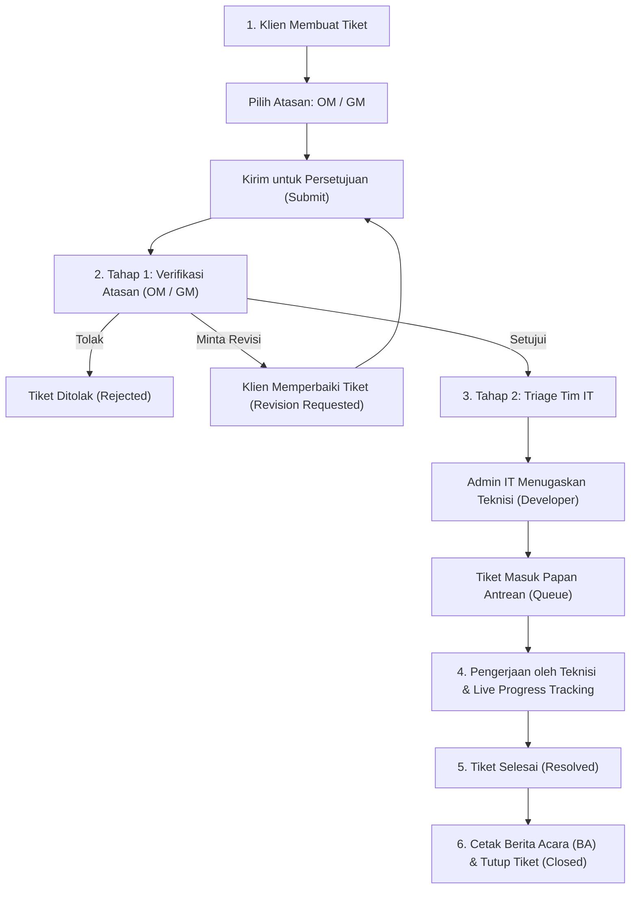

# 📘 BUKU PEDOMAN PENGGUNA (USER MANUAL)
## SISTEM TICKETING & MANAJEMEN PROYEK IT

---

## 📑 DAFTAR ISI
1. [Pendahuluan & Hak Akses (Role)](#1-pendahuluan--hak-akses-role)
2. [Alur Utama Sistem (Workflow Overview)](#2-alur-utama-sistem-workflow-overview)
3. [Panduan untuk Pemohon / Klien (Client)](#3-panduan-untuk-pemohon--klien-client)
4. [Panduan untuk Atasan Manajer (Operational & General Manager)](#4-panduan-untuk-atasan-manajer-operational--general-manager)
5. [Panduan untuk Admin IT / Triage](#5-panduan-untuk-admin-it--triage)
6. [Panduan untuk Teknisi / Developer](#6-panduan-untuk-teknisi--developer)
7. [Panduan untuk Super Admin](#7-panduan-untuk-super-admin)
8. [Tanya Jawab & Troubleshooting (FAQ)](#8-tanya-jawab--troubleshooting-faq)

---

## 1. Pendahuluan & Hak Akses (Role)

Sistem Ticketing & Manajemen Proyek IT adalah aplikasi berbasis web yang dirancang untuk mengelola seluruh siklus permintaan layanan, perbaikan teknis, dan pengembangan proyek teknologi informasi dengan akuntabilitas bertingkat, kepatuhan SLA (*Service Level Agreement*), serta transparansi pelacakan progres secara *real-time*.

### 👥 Struktur Peran Pengguna (User Roles):
| Peran (Role) | Fungsi Utama |
| :--- | :--- |
| **Klien (Client)** | Mengajukan tiket kendala/proyek, memilih atasan penyetuju, memantau pengerjaan, berdiskusi via chat, dan mengunduh Berita Acara pengerjaan. |
| **Operational Manager (OM)** | Atasan level operasional yang memverifikasi dan menyetujui pengajuan tiket sebelum masuk ke Tim IT. |
| **General Manager (GM)** | Atasan level manajerial umum yang memverifikasi dan menyetujui pengajuan tiket strategis sebelum masuk ke Tim IT. |
| **Admin IT** | Melakukan triage tiket yang lolos persetujuan manajer, menugaskan teknisi (*developer*), mengatur antrean pengerjaan, dan mengontrol SLA. |
| **Developer / Teknisi** | Melakukan pengerjaan teknis, memperbarui persentase progres (0–100%), memperbarui tahapan kerja, dan mengisi log harian (*daily log*). |
| **Super Admin** | Mengelola pengguna, hak akses, audit log, konfigurasi sistem aplikasi, dan mencetak laporan kumulatif manajerial. |

---

## 2. Alur Utama Sistem (Workflow Overview)

---

## 3. Panduan untuk Pemohon / Klien (Client)

### A. Cara Membuat Tiket Baru
1. Masuk ke aplikasi dengan akun Anda.
2. Klik tombol **"+ Buat Tiket"** pada bilah menu atas (*Top Bar*) atau menu **"Tiket Baru"** di *Sidebar*.
3. Lengkapi formulir pengajuan:
   - **Nama Proyek / Kendala**: Tuliskan judul masalah secara singkat dan jelas (contoh: *Pemasangan Jaringan Internet Ruang Rapat Lt. 2*).
   - **Kategori Tiket**: Pilih kategori yang sesuai (*Insiden, Permintaan Layanan, Akses, Bug, Dukungan Teknis, dll.*).
   - **Dampak & Urgensi**: Tentukan seberapa mendesak kebutuhan ini (*Rendah, Sedang, Tinggi, Kritis*).
   - **Estimasi Durasi**: Tuliskan perkiraan hari yang diharapkan.
   - **Deskripsi Lengkap**: Uraikan rincian kendala, lokasi, atau spesifikasi teknis.
   - **Persetujuan Atasan (Manager Approval)**:
     - Pilih **Jabatan Atasan** (*Operational Manager* atau *General Manager*).
     - Pilih **Nama Manajer** yang akan memvalidasi permohonan Anda.
   - **Berkas Kebutuhan / Lampiran**: Unggah dokumen pendukung (PDF, Word, atau foto tangkapan layar maksimal 10MB per file).
4. Klik **"Simpan sebagai Draf"**.
5. Pada halaman rincian tiket, klik tombol hijau **"Ajukan Persetujuan"** agar tiket terkirim ke atasan yang dipilih.

### B. Memantau Progres Pengerjaan
- Buka menu **"Permintaan Saya"**.
- Klik tombol **"Lihat Detail"** pada tiket yang ingin dipantau.
- Anda dapat melihat:
  - Status Persetujuan Atasan.
  - Nama Teknisi yang ditugaskan.
  - Bilah Persentase Progres (0–100%) dan catatan aktivitas teknisi.
  - Sisa waktu tenggat SLA.

### C. Menanggapi Permintaan Revisi
- Jika atasan atau Tim IT meminta revisi, status tiket berubah menjadi `Perlu Revisi`.
- Anda akan menerima notifikasi email beserta catatan bagian yang perlu diperbaiki.
- Buka tiket, klik tombol **"Ubah"**, perbaiki data atau berkas lampiran, lalu klik **"Kirim Revisi"**.

### D. Mengunduh & Mencetak Berita Acara Pengerjaan IT (BA)
- Setelah tiket berstatus `Selesai` (*Resolved*) atau `Ditutup` (*Closed*), buka halaman tiket.
- Pada panel samping kanan, klik tombol:
  - **"Unduh Berita Acara (PDF)"** untuk mengunduh dokumen resmi bertanda tangan digital.
  - **"Pratinjau & Cetak BA"** untuk langsung mencetak dokumen fisik melalui browser.

---

## 4. Panduan untuk Atasan Manajer (Operational & General Manager)

### A. Memantau Dasbor Manajerial
Saat login, Anda akan langsung diarahkan ke **Dasbor Monitoring Manajerial** yang memuat:
- **Alert Pengingat**: Notifikasi mencolok jika ada pengajuan tiket bawahan yang membutuhkan persetujuan Anda.
- **Kartu Metrik KPI**:
  - *Menunggu Approval Saya*: Jumlah tiket yang membutuhkan aksi persetujuan.
  - *Tiket Dalam Pengerjaan IT*: Jumlah proyek yang sedang dikerjakan teknisi.
  - *Tiket Selesai Bulan Ini*: Total kendala/proyek yang sukses diselesaikan.
  - *Status SLA*: Memantau apakah pengerjaan berada dalam batas waktu aman atau perlu eskalasi.
- **Tabel Live Tracking Tiket Berjalan**: Memantau nama teknisi PIC, persentase progres, dan status terkini secara real-time.

### B. Memproses Pengajuan Tiket (Persetujuan Saya)
1. Klik menu **"Persetujuan Saya"** di menu atas atau sidebar.
2. Pilih tiket yang ingin ditinjau, lalu klik tombol **"Tinjau"**.
3. Periksa deskripsi kebutuhan dan berkas lampiran yang diunggah pemohon.
4. Berikan salah satu dari 3 keputusan berikut:
   - ✅ **Setujui Pengajuan**: Klik tombol hijau **"Setujui & Teruskan ke IT"**. Tiket akan langsung diteruskan ke Tim IT untuk dijadwalkan pengerjaannya.
   - ⚠️ **Minta Revisi**: Masukkan catatan revisi pada kotak teks, lalu klik tombol kuning **"Kirim Permintaan Revisi"**. Pemohon akan mendapat email instruksi perbaikan.
   - ❌ **Tolak Pengajuan**: Masukkan alasan penolakan pada kotak teks, lalu klik tombol merah **"Tolak Proyek"**.

---

## 5. Panduan untuk Admin IT / Triage

### A. Melakukan Triage & Penugasan Teknisi
1. Buka menu **"Persetujuan"** (`/approvals`).
2. Tiket yang sudah lolos persetujuan atasan akan muncul dengan tanda siap triage.
3. Klik tombol **"Tinjau"** pada tiket.
4. Pada panel persetujuan:
   - Pilih nama **Developer / Teknisi** yang akan menangani tiket.
   - Tambahkan catatan teknis jika diperlukan.
   - Klik **"Setujui & Buat Antrian"**.
5. Tiket secara otomatis masuk ke **Papan Antrean (*Queue*)** dan teknisi terkait akan menerima email penugasan.

### B. Mengelola Papan Antrian (Queues)
- Buka menu **"Papan Antrian"**.
- Anda dapat menyaring tiket berdasarkan status (*Pending, In Progress, Resolved*), tingkat prioritas, maupun nama teknisi.
- Admin IT dapat mengubah penugasan teknisi (*re-assign*) sewaktu-waktu jika teknisi berhalangan.

### C. Menjeda (Pause) & Melanjutkan (Play) SLA Tiket
- Jika pengerjaan tiket terhambat oleh faktor eksternal (misal: menunggu pengiriman suku cadang perangkat keras atau menunggu konfirmasi vendor pihak ketiga):
  - Buka halaman tiket.
  - Klik tombol **"Pause Tiket"**.
  - Waktu perhitungan SLA otomatis berhenti sementara (*paused*).
- Setelah kendala eksternal selesai, klik **"Play Tiket"** untuk melanjutkan perhitungan waktu kerja aktif.

---

## 6. Panduan untuk Teknisi / Developer

### A. Melihat Tugas yang Diberikan
1. Login ke aplikasi, buka menu **"Tiket Saya"** atau **"Papan Antrian"**.
2. Tiket yang ditugaskan kepada Anda akan tampil dengan rincian tenggat waktu pengerjaan.

### B. Memperbarui Progres Pengerjaan (Live Progress Tracking)
1. Pada kartu antrean, klik **"Lihat Progres"**.
2. **Memperbarui Persentase Kerja**: Masukkan angka progres (contoh: 25%, 50%, 75%, 100%) dan klik perbarui.
3. **Memperbarui Tahapan (Stage)**: Pilih tahapan terkini:
   - *Analisis Kebutuhan*
   - *Perancangan & Desain*
   - *Pengerjaan Teknis / Koding*
   - *Pengujian & Validasi*
   - *Implementasi / Deployment*
4. **Mencatat Log Aktivitas**: Tuliskan catatan pengerjaan berkala dan unggah lampiran bukti pengujian/foto perangkat jika ada.

### C. Mengisi Log Harian (Daily Log)
1. Buka menu **"Log Harian"** (`/daily-logs`).
2. Klik **"+ Tambah Log Harian"**.
3. Isi aktivitas pengerjaan yang diselesaikan hari ini beserta kendala teknis yang dihadapi untuk keperluan transparansi laporan kerja.

---

## 7. Panduan untuk Super Admin

### A. Manajemen Pengguna (User Management)
1. Buka menu **"Pengguna & Aset"** (`/super-admin/users`).
2. **Menambah Pengguna Baru**:
   - Klik tombol **"Tambah Pengguna"**.
   - Masukkan Nama, Email, Password, dan pilih Peran (*Client, Developer, Operational Manager, General Manager, Admin, Super Admin*).
   - Klik **"Simpan"**.
3. **Aktivasi / Deaktivasi**:
   - Anda dapat menonaktifkan (*suspend*) akun pengguna yang sudah tidak aktif tanpa menghapus riwayat tiket masa lalu.

### B. Mengelola Laporan Kumulatif & Laporan Teknis
1. Buka menu **"Laporan"** (`/super-admin/reports`).
2. Saring data berdasarkan rentang tanggal, kategori kendala, atau status penyelesaian.
3. Klik:
   - **"Export CSV"** untuk analisis data spreadsheet Excel.
   - **"Export PDF"** untuk mencetak laporan resmi eksekutif.

### C. Pengaturan Sistem (Settings)
1. Buka menu **"Pengaturan"** (`/super-admin/settings`).
2. Anda dapat mengatur:
   - Nama Aplikasi & Instansi.
   - Logo Instansi & Favicon Aplikasi.
   - Durasi Default Target SLA Penyelesaian.
   - Toggle Notifikasi Email (Aktif / Nonaktif).

---

## 8. Tanya Jawab & Troubleshooting (FAQ)

**Q: Mengapa saya tidak bisa mengajukan tiket tanpa memilih manajer?**
> **A:** Sistem menerapkan alur verifikasi internal wajib agar setiap kebutuhan operasional atau proyek disetujui terlebih dahulu oleh pimpinan divisi terkait (Operational Manager / General Manager) sebelum membebani kapasitas kerja Tim IT.

**Q: Bagaimana jika atasan yang dipilih sedang cuti atau tidak dapat merespons?**
> **A:** Super Admin dan Admin IT memiliki hak otorisasi untuk meninjau dan meneruskan tiket secara langsung jika terjadi kondisi darurat (*emergency override*).

**Q: Apakah pemohon mendapatkan pemberitahuan saat tiket selesai?**
> **A:** Ya, sistem akan secara otomatis mengirimkan email konfirmasi penyelesaian beserta ringkasan pengerjaan tiket ke alamat email pemohon.

**Q: Bagaimana cara mencetak Berita Acara yang rapi?**
> **A:** Buka detail tiket yang telah selesai (*Resolved/Closed*), klik **"Pratinjau & Cetak BA"**. Pada jendela cetak browser, pastikan opsi *Background Graphics* dicentang untuk hasil cetak optimal sesuai standar kop surat resmi.

---
*Dokumen ini diterbitkan sebagai pedoman resmi operasional Sistem Antrean & Manajemen Proyek IT.*
