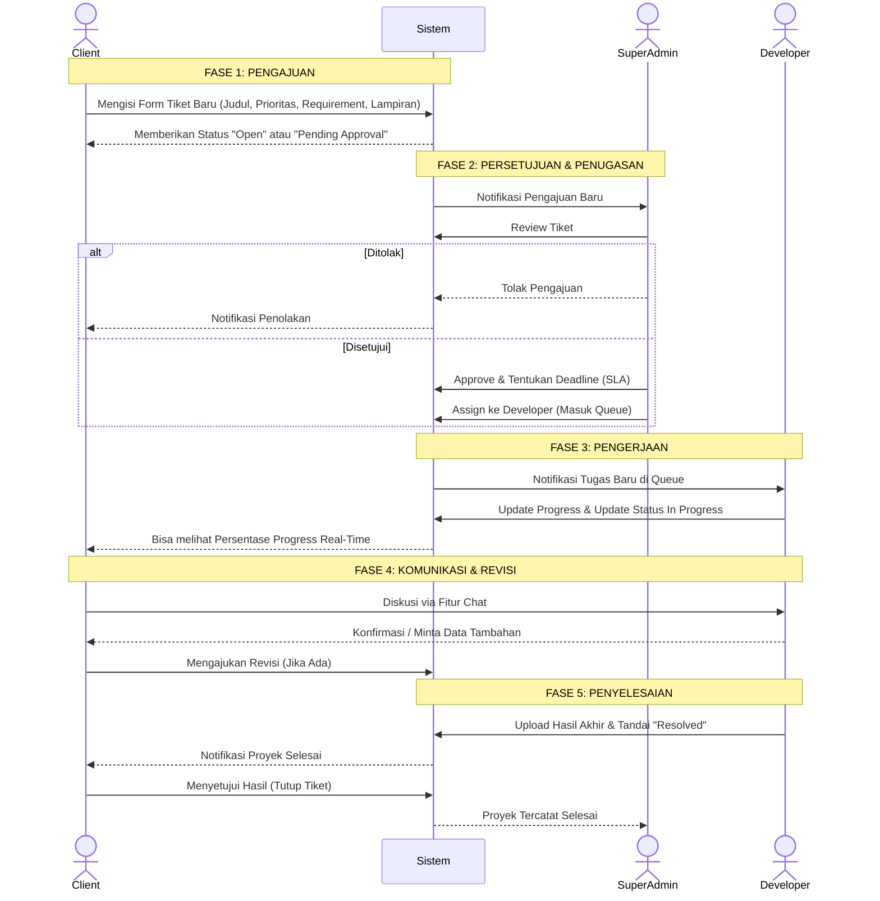

# Alur Sistem Pengajuan Proyek (User Journey)

Dokumen ini menjelaskan langkah demi langkah bagaimana seorang **Client (User)** menggunakan sistem aplikasi Antrian Project untuk mengajukan, memantau, dan menyelesaikan proyek/tiket.

## Diagram Alir (Mermaid)

## Penjelasan Langkah Detail

### 1. Fase Pengajuan (Submission)
- User (*Client*) *login* dan masuk ke *Dashboard*.
- Mengeklik tombol **Tiket Baru** atau masuk menu **Project Requests > Buat Baru**.
- Mengisi detail proyek meliputi:
  - Judul Proyek
  - Kategori
  - Skala Prioritas (Rendah, Sedang, Tinggi)
  - Detail *Requirements* (Kebutuhan proyek)
  - Melampirkan *file* pendukung pendukung.
- Tiket akan masuk ke *database* dengan status `Open`.

### 2. Fase Persetujuan & Penugasan (Approval & Assignment)
- **Super Admin (atau Admin)** mendapatkan notifikasi tiket baru.
- Admin mengevaluasi kelayakan proyek. Jika proyek dirasa kurang sesuai, Admin bisa menolak (*reject*).
- Jika disetujui, Admin merubah status proyek menjadi `In Progress` (Atau *Assigning*), menyesuaikan *Deadline/SLA*, dan menugaskannya ke **Queue Developer** tertentu.

### 3. Fase Pengerjaan (Implementation)
- **Developer** (*Programmer/Designer*) mendapat notifikasi tugas baru.
- Developer memperbarui progres (*Progress Input*) secara rutin, seperti 10%, 50%, dsb., disertai keterangan pekerjaan hari itu.
- *Client* dapat melihat pergerakan progres ini secara *real-time* di *dashboard* mereka.

### 4. Fase Interaksi & Revisi (Interaction & Revision)
- Selama pengerjaan, jika *Client* atau *Developer* membutuhkan komunikasi langsung, mereka dapat menggunakan fitur **Chat**.
- Jika proyek sudah dikirim (misal versi Beta) namun *Client* menemukan ada yang kurang, *Client* bisa melakukan permintaan revisi memalui sistem, yang akan mencatat log revisi dan mengembalikan status ke antrian prioritas.

### 5. Fase Penyelesaian (Resolution)
- Setelah selesai, *Developer* mengunggah dokumen/hasil final dan merubah status tiket menjadi `Resolved`.
- *Client* mengecek hasil akhir. Jika telah sepakat dan sesuai, tiket dinyatakan `Closed` secara permanen.
- Data tiket ini kemudian akan otomatis terekap dalam **Laporan Sistem (PDF/Excel)** yang digunakan oleh manajemen untuk meninjau performa staf dan jumlah layanan yang berhasil diselesaikan.
